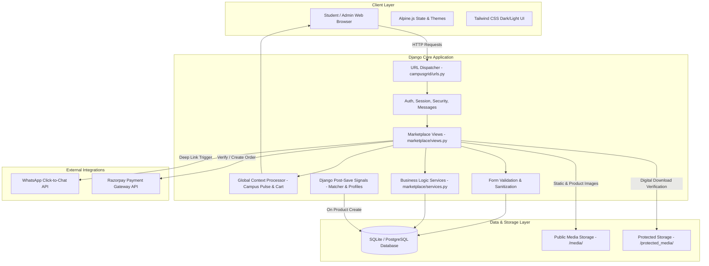
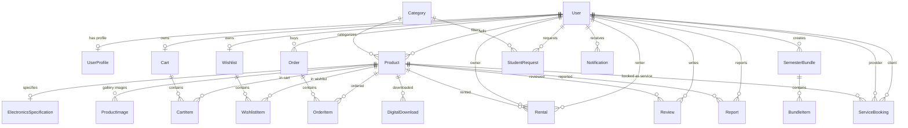

# 🎓 CampusGrid — Multi-Campus P2P Marketplace & Academic Exchange

[](https://www.djangoproject.com/)
[](https://www.python.org/)
[](https://tailwindcss.com/)
[](https://alpinejs.dev/)
[]()
[](LICENSE)

---

## 📌 1. Project Title & High-Level Overview

**CampusGrid** is a production-grade, secure, peer-to-peer (P2P) campus marketplace and academic exchange web platform built with Django. Designed specifically for university ecosystems, CampusGrid solves the friction, scams, and chaos of unorganized student buy-and-sell groups on WhatsApp, Discord, or Reddit.

CampusGrid provides a unified digital ecosystem enabling students and university staff to:
- **Buy, Sell & Rent** pre-owned campus hardware, laptops, textbooks, and hostel essentials directly with verified peers.
- **Compare Electronics** side-by-side using an automated hardware specification evaluator.
- **Distribute & Monetize Digital Academic Assets** (lecture notes, exam study guides, codebases) with protected media storage and verified download gates.
- **Book 1-on-1 Academic Services & Mentorship** with senior students and peer tutors.
- **Pass Down Curated Semester Bundles** (textbooks + notes + lab instruments) at bundled discounts for juniors.
- **Post Student Need Requests** with budget caps, backed by automated real-time background signal matching.
- **Safeguard Campus Handover** with integrated WhatsApp direct messaging and administrative trust/moderation workflows.

---

## ✨ 2. Key Features

### 🎓 1. Student Verification & Trust Engine
- **Academic Email Auto-Detection**: Registrations with `.edu`, `.ac.in`, `.edu.in` domains are automatically recognized and flagged for fast-tracked student verification (`status='PENDING'`).
- **Verified Student Badge**: Displays distinct verification badges on profiles, product cards, and reviews.
- **Staff Moderation Dashboard**: Dedicated UI for administrators to inspect pending student profiles and approve/reject verifications with instant notifications.

### 💻 2. Smart Hardware & Electronics Comparison Engine
- **Side-by-Side Matrix**: Compare any two laptops, tablets, or electronics across processor, RAM, storage type, display specs, OS, usage duration, and battery health %.
- **Objective Winner Calculation**: Real-time evaluation highlights winning specifications with visual badges (e.g., *✓ Higher Storage*, *✓ Better Battery Health*, *✓ Mint Condition*, *✓ Lower Price*).
- **Interactive Selectors**: Easily swap and match candidate hardware listings across the platform.

### 🔄 3. Rental Management with Collision Prevention
- **Dynamic Cost Calculation**: Daily and monthly flexible rental pricing.
- **Booking Conflict Engine**: Algorithmic validation preventing overlapping reservations across active rental states (`APPROVED`, `ACTIVE`, `RETURN_DUE`).
- **Rental Lifecycle Tracker**: Manage states from `REQUESTED` → `APPROVED` → `ACTIVE` → `RETURN_DUE` → `RETURNED` with full notification history.

### 📚 4. Protected Digital Academic Assets & Notes Delivery
- **Two-Tier Storage Architecture**: Public media (preview covers, sample PDFs) is decoupled from protected assets (`protected_media/`).
- **Verified Purchase Gate**: Direct URL downloads are forbidden; downloads require an active session with an associated order marked `payment_status='COMPLETED'`.
- **Download Metrics**: Tracks download counts and last-download timestamps for students and creators.

### 🧑‍🏫 5. Academic Mentorship & Peer Services
- **Service Listings**: Offer peer tutoring, coding reviews, project mentoring, or exam guidance with hourly (`PER_HOUR`) or flat (`FLAT`) rates.
- **Booking Pipeline**: Students select target dates, time slots, and submit topic notes; mentors receive instant booking alerts.

### 📦 6. Curated Semester Pass-Down Bundles
- **Comprehensive Semester Kits**: Graduating or senior students bundle multiple physical textbooks, digital notes, and lab tools (drafters, breadboards) into single-purchase packages.
- **Item-Level Control**: Real-time management to add or remove individual kit components.

### 🎯 7. Student Need Board ("Reverse Marketplace")
- **Demand-Side Requests**: Students post missing items with maximum budget constraints and contact preferences.
- **Automated Signal Matching**: Django `post_save` signals scan open student requests whenever a new listing is published and automatically dispatches notification alerts to matching requesters.

### 💬 8. Direct WhatsApp Handover Integration
- **Context-Aware Deep Linking**: Click-to-Chat URLs pre-fill sanitized item titles, pricing, and campus meetup notes directly to the seller’s WhatsApp without exposing raw contact details unnecessarily.

### 🛒 9. Cart, Multi-Modal Checkout & Payments
- **Dynamic Shopping Cart**: Supports quantity updates and prevents self-dealing (sellers cannot buy or rent their own items).
- **Flexible Payments**: Out-of-the-box support for **Cash on Campus Handover (COD)** and **Razorpay Online Payments** integration.

### 📊 10. Seller Dashboard & Financial Center
- **Aggregated Revenue Insights**: Combines completed physical sales, digital downloads, and rental earnings into unified financial metrics.
- **Inventory Control**: 1-click product availability toggling, editing, and gallery image management.

### 🛡️ 11. Content Moderation & Abuse Reporting
- **Community Safety**: Students can report misleading, prohibited, or scam listings.
- **Moderation Actions**: Administrators can resolve reports by disabling listings or dismissing false reports.

### 🔔 12. Automated In-App Notification Center
- Categorized notifications (`ORDER`, `RENTAL`, `VERIFICATION`, `MATCHING_REQUEST`, `REVIEW`, `DIGITAL_READY`, `SYSTEM`) with unread counters and read status tracking.

---

## 🛠️ 3. Tech Stack & System Architecture

### Technologies Used
| Layer | Technology | Description |
|---|---|---|
| **Backend Framework** | Django 5.x | High-level Python Web Framework (MTV Architecture) |
| **Language** | Python 3.10 – 3.13 | Core backend programming language |
| **Database** | SQLite 3 (Dev) / PostgreSQL (Prod) | Relational Database Management System |
| **Image & Media Engine** | Pillow (PIL) 10.x | Image processing & synthetic product artwork generator |
| **Styling & Design System** | Tailwind CSS 3.x (CDN) | Modern utility-first CSS with dark/light mode support |
| **Client Reactivity** | Alpine.js 3.x | Lightweight reactive state management (modals, dropdowns) |
| **Icons & Typography** | Lucide Icons + Google Fonts | Plus Jakarta Sans & Inter typography |
| **Animations & Visuals** | GSAP 3.x + Three.js | Smooth page transitions and subtle depth canvas |
| **Testing** | Django Test Framework (unittest) | Comprehensive automated test suite (19 test cases) |

---

### System Architecture Diagram



---

### Database Schema (Entity Relationship)



---

## 📋 4. Prerequisites & Environment Setup

- **Python**: Version `3.10`, `3.11`, `3.12`, or `3.13` installed.
- **Git**: Installed on your operating system.
- **Terminal / Shell**: PowerShell (Windows), Bash, or Zsh (macOS / Linux).

---

## 🚀 5. Installation & Running Locally

### Step 1: Clone the Repository
```bash
git clone <repository-url>
cd <project-folder>
```

### Step 2: Create and Activate a Virtual Environment

**On Windows (PowerShell):**
```powershell
python -m venv venv
.\venv\Scripts\Activate.ps1
```

**On macOS / Linux:**
```bash
python3 -m venv venv
source venv/bin/activate
```

---

### Step 3: Install Dependencies
```bash
pip install -r requirements.txt
```

---

### Step 4: Configure Environment Variables
Copy the `.env.example` template:
```bash
# Windows PowerShell
Copy-Item .env.example .env

# macOS / Linux
cp .env.example .env
```

---

### Step 5: Run Database Migrations
```bash
python manage.py migrate
```

---

### Step 6: Seed Rich Sample Data & Realistic Product Artwork
CampusGrid includes a comprehensive management command that populates demo users, product categories, laptops with hardware specs, digital notes, academic services, pass-down bundles, student requests, reviews, and automatically renders high-resolution artwork using Pillow:
```bash
python manage.py seed_data
```

---

### Step 7: Create a Superuser (Optional)
*(Note: `seed_data` already provisions an admin user with credentials `admin` / `admin123`)*
```bash
python manage.py createsuperuser
```

---

### Step 8: Start the Local Development Server
```bash
python manage.py runserver
```
Visit **[http://127.0.0.1:8000](http://127.0.0.1:8000)** in your browser!

---

### 🔑 Demo Accounts Provisioned by `seed_data`
| Role | Username | Password | Notes |
|---|---|---|---|
| **Administrator / Staff** | `admin` | `admin123` | Full access to `/admin/` & `/moderation/` dashboard |
| **Student (Seller)** | `alex_cs` | `campus123` | CS Senior at IIT Bombay (Laptops, notes, mentorship) |
| **Student (Seller)** | `priya_ee` | `campus123` | EE Student at BITS Pilani (iPads, calculators, bundles) |
| **Student (Buyer)** | `rahul_mech` | `campus123` | Mech Student at NIT Trichy (XPS 13, textbooks) |
| **Student (Seller)** | `ananya_ds` | `campus123` | DS Student at IIIT Delhi (ThinkPad, DSA notes) |
| **Student (Seller)** | `kavita_ce` | `campus123` | CE Student at DTU (Arduino kits, TI-84) |

---

## ⚙️ 6. Environment Variables Guide (`.env.example`)

| Variable Name | Default Value | Description |
|---|---|---|
| `DJANGO_SECRET_KEY` | `django-insecure-...` | Secret key used for cryptographic signing |
| `DJANGO_DEBUG` | `True` | Debug mode (`True` for local development, `False` for production) |
| `DJANGO_ALLOWED_HOSTS` | `*` or `127.0.0.1,localhost` | Comma-separated list of host/domain names allowed to serve the app |
| `RAZORPAY_KEY_ID` | `rzp_test_campusgrid_mock_key` | Razorpay API Public Key Identifier |
| `RAZORPAY_KEY_SECRET` | `mock_secret_key_for_testing` | Razorpay API Key Secret |
| `EMAIL_BACKEND` | `console.EmailBackend` | Email backend for development testing and password resets |

---

## 🌐 7. API Endpoints & URL Routing Overview

| Module | HTTP Method | URL Path | View Name | Access Control | Description |
|---|---|---|---|---|---|
| **Global** | `GET` | `/` | `marketplace:index` | Public | Homepage with campus pulse, featured & urgent items |
| **Global** | `GET` | `/set-campus/` | `marketplace:set_campus` | Public | Set selected campus in session |
| **Catalogue** | `GET` | `/products/` | `marketplace:product_list` | Public | Search and multi-facet filtering catalogue |
| **Catalogue** | `GET` | `/products/<slug>/` | `marketplace:product_detail` | Public | Product details, specs, WhatsApp CTA, and reviews |
| **Digital** | `GET` | `/products/<slug>/download/` | `marketplace:digital_download` | Authenticated (Purchased) | Secure download gate for digital assets |
| **Compare** | `GET` | `/compare/` | `marketplace:compare` | Public | Side-by-side electronics comparison matrix |
| **Cart** | `GET` | `/cart/` | `marketplace:cart_view` | Authenticated | View current shopping cart |
| **Cart** | `GET` | `/cart/add/<product_id>/` | `marketplace:add_to_cart` | Authenticated | Add listing to user's cart |
| **Cart** | `GET` | `/cart/remove/<item_id>/` | `marketplace:remove_from_cart` | Authenticated | Remove item from cart |
| **Cart** | `POST` | `/cart/update/<item_id>/` | `marketplace:update_cart_quantity` | Authenticated | Update item quantity in cart |
| **Checkout** | `GET`, `POST` | `/checkout/` | `marketplace:checkout` | Authenticated | Order placement & payment method selection |
| **Orders** | `GET` | `/orders/` | `marketplace:orders_list` | Authenticated | Buyer orders and incoming seller sales |
| **Orders** | `GET` | `/orders/<order_id>/` | `marketplace:order_detail` | Authenticated (Owner/Admin) | Detailed invoice and delivery status |
| **Rentals** | `POST` | `/rent/<product_id>/` | `marketplace:rent_product` | Authenticated | Submit rental request with date range |
| **Rentals** | `GET` | `/rentals/` | `marketplace:rentals_list` | Authenticated | View active and requested rentals |
| **Rentals** | `POST` | `/rentals/<rental_id>/update/`| `marketplace:update_rental_status` | Authenticated (Owner) | Transition rental state (Approved, Returned, etc.) |
| **Wishlist** | `GET` | `/wishlist/` | `marketplace:wishlist_view` | Authenticated | View saved wishlist items |
| **Wishlist** | `GET`, `POST` | `/wishlist/toggle/<product_id>/`| `marketplace:toggle_wishlist` | Authenticated | Toggle product in/out of wishlist (AJAX ready) |
| **Bundles** | `GET` | `/bundles/` | `marketplace:semester_bundles_list`| Public | View semester pass-down packages |
| **Bundles** | `GET`, `POST` | `/bundles/create/` | `marketplace:create_bundle` | Authenticated | Create a new semester kit |
| **Bundles** | `GET` | `/bundles/<slug>/` | `marketplace:bundle_detail` | Public | Detailed bundle contents and item breakdown |
| **Bundles** | `GET`, `POST` | `/bundles/<id>/edit/` | `marketplace:edit_bundle` | Authenticated (Owner) | Add/remove items or edit bundle info |
| **Bundles** | `POST` | `/bundles/<id>/delete/` | `marketplace:delete_bundle` | Authenticated (Owner) | Delete a bundle |
| **Requests** | `GET` | `/requests/` | `marketplace:student_requests_list`| Public | Student Need Board listing |
| **Requests** | `POST` | `/requests/create/` | `marketplace:create_request` | Authenticated | Post a new demand request |
| **Requests** | `POST` | `/requests/<id>/close/` | `marketplace:close_student_request` | Authenticated (Requester)| Mark request as matched/closed |
| **Services** | `POST` | `/services/book/<product_id>/` | `marketplace:book_service_session` | Authenticated | Book a 1-on-1 tutoring/mentorship slot |
| **Reviews** | `POST` | `/products/<id>/review/` | `marketplace:add_review` | Authenticated | Post verified rating and feedback |
| **Reports** | `POST` | `/products/<id>/report/` | `marketplace:report_product` | Authenticated | File violation report to admin |
| **Alerts** | `GET` | `/notifications/` | `marketplace:notifications_view`| Authenticated | View in-app notification center |
| **Alerts** | `GET` | `/notifications/<id>/read/` | `marketplace:mark_notification_read`| Authenticated | Mark notification read and redirect |
| **Alerts** | `GET` | `/notifications/mark-all-read/`| `marketplace:mark_all_notifications_read`| Authenticated | Mark all notifications read |
| **Seller** | `GET` | `/seller/` | `marketplace:seller_dashboard` | Authenticated | Revenue metrics, orders, active inventory |
| **Seller** | `GET`, `POST` | `/seller/products/add/` | `marketplace:add_product` | Authenticated | Create physical/digital/service listing |
| **Seller** | `GET`, `POST` | `/seller/products/<id>/edit/` | `marketplace:edit_product` | Authenticated (Owner) | Edit product details or hardware specs |
| **Seller** | `POST` | `/seller/products/<id>/delete/`| `marketplace:delete_product` | Authenticated (Owner) | Remove product listing |
| **Seller** | `GET`, `POST` | `/seller/products/<id>/toggle/`| `marketplace:toggle_product_availability`| Authenticated (Owner)| Toggle item active / sold out |
| **Auth** | `GET`, `POST` | `/register/` | `marketplace:register` | Public | Student signup with academic email detection |
| **Auth** | `GET`, `POST` | `/login/` | `marketplace:login` | Public | Account authentication |
| **Auth** | `GET`, `POST` | `/logout/` | `marketplace:logout` | Authenticated | Session termination |
| **Profile** | `GET`, `POST` | `/profile/` | `marketplace:user_profile` | Authenticated | Manage avatar, bio, campus, phone, WhatsApp |
| **Admin** | `GET` | `/moderation/` | `marketplace:moderation_dashboard`| Staff Only | Moderate student verifications and reports |
| **Admin** | `POST` | `/moderation/verify/<id>/` | `marketplace:admin_approve_verification`| Staff Only | Approve student verification |
| **Admin** | `POST` | `/moderation/report/<id>/` | `marketplace:admin_resolve_report` | Staff Only | Resolve or dismiss listing report |
| **Django Admin**| `GET`, `POST`| `/admin/` | `admin:index` | Staff / Superuser | Full relational database administration |

---

## 📂 8. Project Directory Structure Tree

```
campusgrid/
├── campusgrid/                     # Django Core Project Configuration
│   ├── __init__.py
│   ├── asgi.py                     # ASGI Configuration for asynchronous servers
│   ├── settings.py                 # Application Settings & Security Config
│   ├── urls.py                     # Root URL Router
│   └── wsgi.py                     # WSGI Application entrypoint
├── marketplace/                    # CampusGrid Primary Application
│   ├── management/
│   │   └── commands/
│   │       ├── __init__.py
│   │       └── seed_data.py        # Demo Data Generator with Pillow Graphics
│   ├── migrations/                 # Database Schema Migrations
│   │   ├── 0001_initial.py
│   │   ├── 0002_alter_product_digital_file.py
│   │   └── __init__.py
│   ├── static/                     # Static Assets (CSS, JS, Logos)
│   │   ├── css/
│   │   ├── images/
│   │   └── js/
│   ├── templates/                  # Full Jinja2/Django Template Suite
│   │   ├── base.html               # Master Layout (Tailwind, Dark Theme, Navbar)
│   │   ├── marketplace/
│   │   │   ├── add_bundle.html     # Create Semester Bundle
│   │   │   ├── add_product.html    # Create Product/Service Listing
│   │   │   ├── bundle_detail.html  # Semester Bundle Showcase
│   │   │   ├── bundles.html        # Bundle Catalogue
│   │   │   ├── cart.html           # Shopping Cart View
│   │   │   ├── checkout.html       # Order Placement & Checkout
│   │   │   ├── compare.html        # Smart Electronics Comparison Matrix
│   │   │   ├── dashboard.html      # Student Hub & Recommendations
│   │   │   ├── edit_bundle.html    # Bundle Item Management
│   │   │   ├── edit_product.html   # Listing Editor
│   │   │   ├── index.html          # Marketplace Landing Page
│   │   │   ├── moderation.html     # Admin Verification & Report Desk
│   │   │   ├── notifications.html  # Notification Center
│   │   │   ├── order_detail.html   # Invoice & Handover Receipt
│   │   │   ├── orders.html         # Purchase & Sales History
│   │   │   ├── product_detail.html # Product Showcase, WhatsApp & Reviews
│   │   │   ├── product_list.html   # Filterable Product Catalogue
│   │   │   ├── profile.html        # User Profile Management
│   │   │   ├── rentals.html        # Rental Tracker & Transitions
│   │   │   ├── requests.html       # Student Need Board
│   │   │   ├── seller_dashboard.html # Seller Revenue & Inventory Hub
│   │   │   └── wishlist.html       # Saved Products Grid
│   │   └── registration/           # Authentication Templates
│   │       ├── login.html
│   │       ├── logout_confirm.html
│   │       ├── password_reset_complete.html
│   │       ├── password_reset_confirm.html
│   │       ├── password_reset_done.html
│   │       ├── password_reset_form.html
│   │       └── register.html
│   ├── admin.py                    # Django Admin Model Configurations
│   ├── apps.py                     # App Configuration & Signal Registration
│   ├── context_processors.py       # Global Pulse, Unread Notifications & Cart
│   ├── forms.py                    # Form Validation & File Extension Checkers
│   ├── models.py                   # 14 Relational Database Models
│   ├── services.py                 # Comparison Engine, Rental Conflict & WhatsApp
│   ├── signals.py                  # Auto Profile Init & Need Matcher Signals
│   ├── tests.py                    # Comprehensive 19-Scenario Test Suite
│   ├── urls.py                     # App Route Definitions
│   └── views.py                    # Complete Controller & View Handlers
├── media/                          # Public Uploads (Thumbnails, Sample PDFs)
├── protected_media/                # Protected Digital Assets (Notes, Code ZIPs)
├── .env.example                    # Environment Variables Template
├── db.sqlite3                      # Local SQLite Database
├── manage.py                       # Django CLI Management Script
├── README.md                       # Comprehensive Project Documentation
└── requirements.txt                # Python Dependencies
```

---

## 🧪 9. Testing & Verification Instructions

CampusGrid includes a comprehensive automated test suite in [`marketplace/tests.py`](marketplace/tests.py) with **19 rigorous test cases** validating:
1. **Academic Email Auto-Detection**: Registration with `.edu` domains assigns `PENDING` verification status.
2. **Authentication Flow**: Complete login and logout session cycle.
3. **Password Reset Routes**: Verifies template rendering for password recovery.
4. **Product CRUD Lifecycle**: Creating, editing, and deleting Physical, Digital, and Service products.
5. **Gallery Image Management**: Uploading and removing supplementary product gallery photos.
6. **Anti-Self-Dealing Safeguards**: Prevents users from purchasing, renting, reviewing, or reporting their own listings.
7. **Rental Date Conflict Resolution**: Verifies collision prevention across overlapping dates with active rentals.
8. **Digital Asset Gate**: Ensures unpurchased/pending digital assets are blocked and completed orders receive `application/pdf` streams.
9. **Wishlist Operations**: Adding and removing items from personal wishlist.
10. **Semester Bundle Composition**: Adding and removing items inside a multi-item bundle.
11. **Electronics Comparison Engine**: Generates matrix scores and calculates winning specs.
12. **Cart & Checkout Lifecycle**: Cart item summation, order placement, and notification dispatch.
13. **Moderation Permissions & Actions**: Verifies student approval and listing deactivation actions.
14. **File Extension Validation**: Validates image and PDF file format and size constraints.

### Run All Tests
```bash
python manage.py test
```

### Run Tests with Verbose Output
```bash
python manage.py test marketplace -v 2
```

---

## 🛡️ License

This project is licensed under the MIT License — see the [LICENSE](LICENSE) file for details.

---

<div align="center">
  <sub>Built with ❤️ for student communities worldwide.</sub>
</div>
