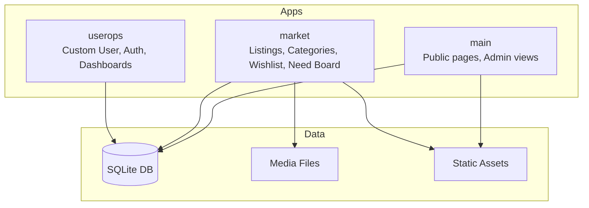

# CampusGrid — Django Campus Marketplace

> **Student-to-student marketplace for campus resources** — laptops, textbooks, notes, lab gear, rentals, services & more.

---

## 1. Executive Summary

| Aspect | Details |
|--------|---------|
| **Project** | CampusGrid — Campus Marketplace Platform |
| **Type** | Django server-rendered web application |
| **Target Users** | University/college students |
| **Core Value** | Peer-to-peer buying, selling, renting, services, and need-requests on campus |
| **Status** | Active development — functional core, known migration/test issues |

---

## 2. Key Features

### Marketplace (market app)
- **Listings**: Sale / Rent / Service / Digital Asset
- **Categories**: Laptops, Books, Notes, Lab Gear, Hostel Essentials, Mobility, Services
- **Filters**: Category, Type, Condition, Search text
- **Product Detail**: Images, seller info, condition, location, negotiation flag
- **Comparison Page**: Side-by-side product specs
- **Wishlist**: Per-user save/remove with AJAX

### Need Board (Reverse Marketplace)
- **Request Types**: Buy / Borrow / Service
- **Urgency Levels**: Urgent / Moderate / Flexible
- **Peer Offers**: Direct responses with price/message
- **Status Tracking**: Open → Fulfilled / Closed

### User Operations (userops app)
- **Custom User Model**: `App_users` (email unique, roles, institution, phone)
- **Registration/Login**: Form validation, password confirmation
- **Profile**: Editable institution & phone
- **Dashboards**:
  - Admin: User management, stats, role toggle
  - User: Own listings, wishlist, need requests

### Public Pages (main app)
- Home (featured products + categories)
- About / Contact
- Admin dashboard (user management)

---

## 3. Technology Stack

| Layer | Technology |
|-------|------------|
| **Backend** | Django 6.1.1 |
| **Language** | Python 3.10+ |
| **Database** | SQLite (dev) |
| **Image Handling** | Pillow 12.3.0 |
| **Frontend** | Django Templates, CSS, Vanilla JS |
| **Auth** | Django Auth + Custom `AUTH_USER_MODEL = 'userops.App_users'` |
| **Static/Media** | `STATICFILES_DIRS`, `MEDIA_ROOT` (dev serving) |

---

## 4. Project Structure

```
CampusGrid/
├── README.md                    # This file
├── plan/                        # Planning docs
└── server/
    ├── manage.py
    ├── requirements.txt         # Django==6.1.1, Pillow==12.3.0
    ├── sample.json              # Demo fixture (6 categories, 6 users, 6 listings)
    ├── db.sqlite3               # Dev database
    ├── config/                  # Django settings, root URLs, WSGI
    ├── main/                    # Public pages, admin views
    ├── market/                  # Marketplace core (models, views, forms)
    ├── userops/                 # Custom user, auth, dashboards
    ├── templates/               # Base + app templates
    │   ├── base/
    │   ├── home/
    │   ├── marketplace/
    │   ├── need_board/
    │   ├── user/
    │   ├── admin/
    │   └── dashboard/
    ├── static/                  # CSS, JS, Images
    │   ├── css/
    │   ├── js/
    │   └── images/
    └── media/                   # Uploaded listing images (gitignored)
```

---

## 5. Database Schema (Key Models)

### `userops.App_users` (Custom User)
- Extends `AbstractUser`
- `email` — unique, required
- `user_roles` — USER / ADMIN
- `institution` — optional
- `phone` — validated regex
- `is_verified` property — .edu / .ac.in / .edu.in domains

### `market.Category`
- `name`, `slug` (unique), `description`, `is_active`

### `market.Listing` (alias `Product`)
- **Core**: `seller` (FK→User), `category` (FK), `title`, `slug`, `description`
- **Pricing**: `price`, `listing_type` (SALE/RENT/SERVICE/DIGITAL)
- **Condition**: NEW / LIKE_NEW / GOOD / FAIR / POOR
- **Rental**: `rental_period` (DAY/MONTH/SEMESTER)
- **Logistics**: `location`, `is_negotiable`, `is_urgent`
- **Lifecycle**: `status` (DRAFT/ACTIVE/RESERVED/SOLD/RENTED/EXPIRED/CANCELLED)
- **Images**: via `ListingImage` (multiple, one primary)

### `market.Wishlist`
- Unique constraint: (user, listing)

### `market.NeedRequest`
- `requester`, `category`, `request_type`, `urgency`, `max_budget`
- `status` (OPEN/FULFILLED/CLOSED)

### `market.NeedOffer`
- `need_request`, `responder`, `message`, `offered_price`

---

## 6. URL Routes

### Public
| Path | View | Name |
|------|------|------|
| `/` | Home | `home` |
| `/about/` | About | `about` |
| `/contact/` | Contact | `contact` |
| `/products/` | Marketplace list | `products` |
| `/categories/` | Category directory | `categories` |
| `/compare/` | Comparison | `compare` |
| `/requests/` | Need board | `requests` |
| `/requests/board/` | Need board (CBV) | `need_board` |

### Auth & Account
| Path | View | Name |
|------|------|------|
| `/register/` | Register | `register` |
| `/login/` | Login | `login` |
| `/logout/` | Logout | `logout` |
| `/profile/` | Edit profile | `profile` |
| `/dashboard/admin/` | Admin dashboard | `admin_dashboard` |
| `/dashboard/user/` | User dashboard | `user_dashboard` |
| `/dashboard/wishlist/` | Wishlist | `wishlist` |
| `/dashboard/listings/` | My listings | `dashboard_listings` |
| `/dashboard/requests/` | My need requests | `dashboard_requests` |

### Marketplace Actions
| Path | View | Name |
|------|------|------|
| `/create/` | Create listing | `create_listing` |
| `/seller/products/add/` | Create listing (alt) | `seller_products_add` |
| `/wishlist/<id>/` | Toggle wishlist | `add_wishlist` |
| `/requests/create/` | Create need request | `create_need_request` |
| `/requests/<pk>/` | Need request detail | `need_request_detail` |
| `/requests/<pk>/offer/` | Submit offer | `create_need_offer` |

---

## 7. Setup & Run

```bash
cd server
python -m venv venv
source venv/bin/activate       # Windows: .\venv\Scripts\Activate.ps1
pip install -r requirements.txt
python manage.py migrate
python manage.py loaddata sample.json
python manage.py runserver
# Open http://127.0.0.1:8000/
```

### Create Admin User
```bash
python manage.py createsuperuser
# Access /admin/
```

### Database Reset
```bash
cd server
rm -f db.sqlite3
python manage.py migrate
python manage.py loaddata sample.json
```

### Run Tests
```bash
python manage.py check
python manage.py test
# App-specific:
python manage.py test userops
python manage.py test market
```

---

## 8. Static & Media Assets

| Type | Path | Served Via |
|------|------|------------|
| **Static (CSS/JS/Icons)** | `server/static/` | `STATICFILES_DIRS` |
| **Catalog Images** | `static/images/marketplace/products/` | Static files |
| **Uploaded Listing Images** | `media/listings/images/` | `MEDIA_ROOT` (dev only) |

> ⚠️ `media/` is in `.gitignore`. Production needs persistent media store (S3, NFS, etc.) and web server (Nginx) for static/media.

---

## 9. Current Limitations & Known Issues

| Issue | Impact | Location |
|-------|--------|----------|
| **Duplicate migration `0002_initial.py`** | Breaks fresh `migrate` & tests (`duplicate column: category_id`) | `market/migrations/0002_initial.py` |
| **Missing `product_detail` URL** | `NoReverseMatch` on product links | `market/urls.py`, templates |
| **`_get_active_products` undefined** | `NameError` in compare view fallback | `market/views.py:150` |
| **`User` not imported in `userops/views.py`** | `NameError` on admin dashboard views | `userops/views.py` |
| **Class-based `AdminDashboard` lacks admin check** | Any logged-in user can access `/dashboard/admin/` | `userops/views.py` |
| **Password reset routes commented** | Test failures, no password recovery | `userops/urls.py` |
| **Duplicate admin views** | Code duplication (`main` + `userops`) | `main/views.py`, `userops/views.py` |
| **Dev-only settings** | Insecure for production | `config/settings.py` |

---

## 10. Demo Data (sample.json)

- **6 Categories**: Laptops, Books, Notes, Lab Gear, Hostel, Mobility
- **6 Student Users**: Verified .edu emails, dummy PBKDF2 hashes
- **6 Listings**: MacBook Pro, Calculus textbook, DSA notes, Calculator rental, iPad Air, Chemistry book

---

## 11. Contribution Workflow

1. Create feature branch
2. Activate venv, install requirements
3. `python manage.py check`
4. Run relevant tests (`python manage.py test <app>`)
5. Keep changes scoped: templates, CSS, JS, migrations, backend
6. Open PR

---

## 12. Quick Architecture Diagram (Mermaid)



---

## 13. Screenshots / UI Sections (For Slides)

| Page | Template | Key UI Elements |
|------|----------|-----------------|
| Home | `home/index.html` | Hero, featured products grid, category cards |
| Marketplace | `marketplace/products.html` | Sidebar filters, product cards, pagination |
| Product Detail | `marketplace/product_detail.html` | Image gallery, specs, seller card, wishlist btn |
| Compare | `marketplace/compare.html` | Dual-column spec table, selector dropdowns |
| Need Board | `need_board/index.html` | Filter tabs, request cards, urgency badges |
| Need Detail | `need_board/detail.html` | Request info, offers list, offer form |
| Register/Login | `user/register.html`, `user/login.html` | Form fields, validation messages |
| Admin Dashboard | `admin/dashboard.html` | Stats cards, recent users table |
| Admin Users | `admin/users.html` | Search, role/status filters, pagination, actions |
| User Dashboard | `dashboard/dashboard.html` | Listings, wishlist, requests tabs |
| Profile | `user/profile.html` | Editable institution, phone |

---

## 14. Configuration Notes (Dev)

```python
DEBUG = True
ALLOWED_HOSTS = ['*']
SECRET_KEY = 'django-insecure-...'  # Rotate for production!
DATABASES = {'default': {'ENGINE': 'sqlite3', 'NAME': BASE_DIR / 'db.sqlite3'}}
EMAIL_BACKEND = 'console.EmailBackend'
AUTH_USER_MODEL = 'userops.App_users'
LOGIN_URL = '/login/'
```

> ⚠️ **Production Checklist**: Environment-based secrets, restricted `ALLOWED_HOSTS`, `SECURE_SSL_REDIRECT`, `CSRF_COOKIE_SECURE`, PostgreSQL/MySQL, real email backend, CDN/media storage, `DEBUG=False`.

---

## 15. File Inventory (Core)

```
server/
├── config/
│   ├── settings.py      # 138 lines
│   ├── urls.py          # Root URLconf
│   └── wsgi.py
├── main/
│   ├── views.py         # Home, About, Contact, Admin views
│   ├── urls.py          # Public + admin routes
│   └── tests.py         # Empty
├── market/
│   ├── models.py        # 321 lines (Category, Listing, Image, Wishlist, NeedRequest, NeedOffer)
│   ├── views.py         # 482 lines (MarketView, ProductDetail, NeedBoard, CRUD)
│   ├── forms.py         # 284 lines (ListingForm, NeedRequestForm, NeedOfferForm)
│   ├── urls.py          # Marketplace routes (app_name='market')
│   ├── admin.py         # ModelAdmin configs
│   ├── tests.py         # 91 lines (auth + filter tests)
│   ├── psudodeta.py     # Sample data fallbacks
│   └── migrations/
│       ├── 0001_initial.py  # Complete schema
│       └── 0002_initial.py  # DUPLICATE — causes failures
├── userops/
│   ├── models.py        # 53 lines (App_users)
│   ├── views.py         # 331 lines (Register, Login, Dashboards, Wishlist, Profile)
│   ├── form.py          # 86 lines (UserRegForm, LoginForm, UserProfileForm)
│   ├── urls.py          # Auth + dashboard routes
│   ├── admin.py         # User admin
│   ├── tests.py         # 101 lines (registration, admin tests)
│   └── migrations/
│       └── 0001_initial.py
└── templates/           # ~25 templates across base/, home/, marketplace/, need_board/, user/, admin/, dashboard/
```

---

## 16. Next Steps / Roadmap

1. **Fix migration duplication** → delete `0002_initial.py`, re-migrate
2. **Add `product_detail` URL** + fix `ProductDetailView.get_object`
3. **Define `_get_active_products`** or remove fallback
4. **Import `get_user_model()`** in `userops/views.py`
5. **Add `@user_passes_test(is_admin)`** to class-based `AdminDashboard`
6. **Uncomment/enable password reset** routes
7. **Consolidate duplicate admin views** (`main` vs `userops`)
8. **Add password field masking** in `LoginForm`
9. **Production hardening** (settings, static/media, DB)
10. **Expand test coverage** (fixtures, edge cases)

---

*Generated for presentation preparation — covers architecture, features, data model, routes, setup, and current state.*